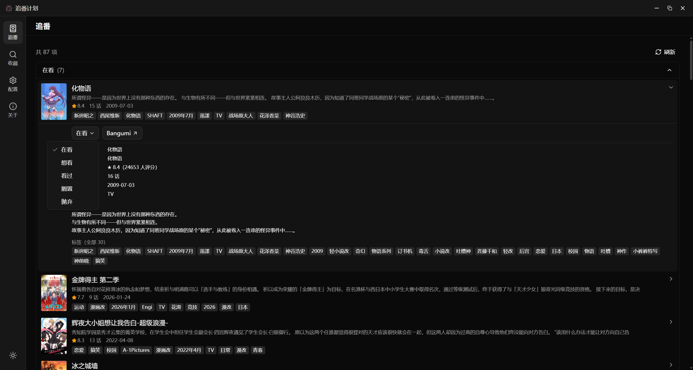
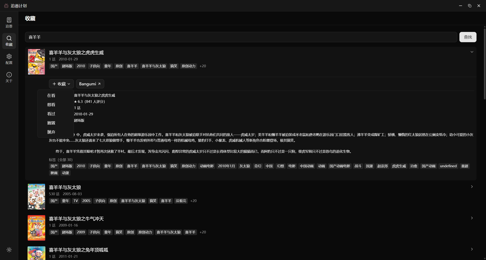

<p align="center"></p>

# 追番计划

基于 [Bangumi](https://bgm.tv) API 的 Windows 桌面端追番记录应用，收藏**漫画**与**动画**。

<p align="left">
  
  
  
  
  
  
</p>

<p align="center">
  <table>
    <tr>
      <td></td>
      <td></td>
    </tr>
    <tr>
      <td align="center"><sub>追番页</sub></td>
      <td align="center"><sub>收藏页</sub></td>
    </tr>
  </table>
</p>

## 功能

- **追番** — 五个收藏夹（在看/想看/看过/搁置/抛弃）折叠分组展示，条目可展开查看详情与改收藏夹
- **收藏** — 按名称搜索条目，展开后加入收藏夹
- **配置** — 填写自注册的 Bangumi 应用凭据，OAuth 登录，显示用户资料
- **关于** — 应用信息与数据所有权声明

## 首次使用

1. 到 [bgm.tv 开发者后台](https://bgm.tv/dev/app) 注册应用，**回调地址**填 `http://localhost:7359/callback`
2. 启动应用 →「配置」→ 填入 Client ID / Client Secret
3. 点击「Bangumi 认证」，浏览器授权后回到应用即完成

> 凭据仅存本地，应用不带任何内置凭据。

## 开发

```bash
npm install
npm run tauri dev    # 开发模式
npm run tauri build  # 打包 Windows 安装包
```

## 说明

- 收藏默认**私密**（`private: true`）
- 封面用缩略图（`images.small`），展开详情懒加载完整数据（TanStack Query 缓存）
- API 请求走 Rust 侧 `@tauri-apps/plugin-http`，注入 User-Agent 并绕过 CORS
- 本地仅存 OAuth 凭据/令牌/偏好，条目数据不落库
