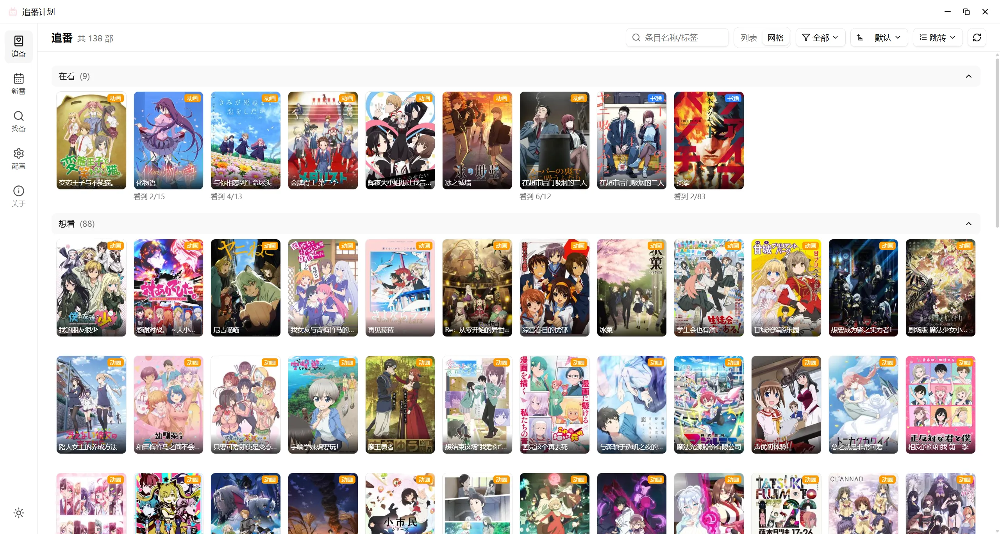
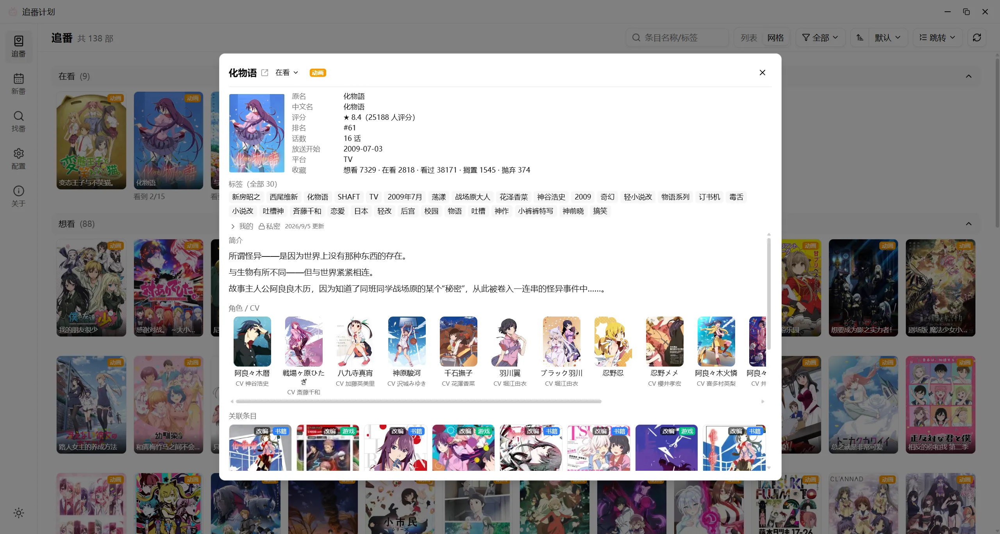
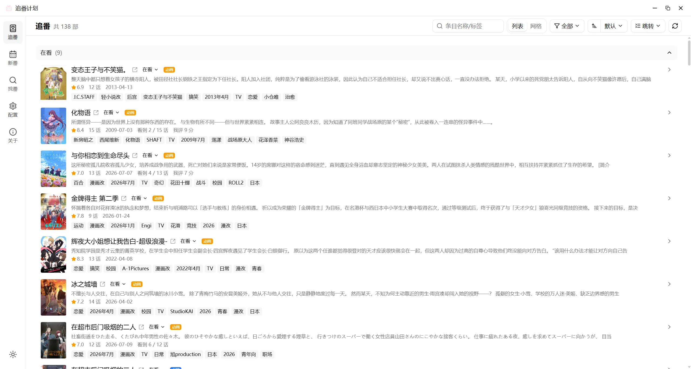
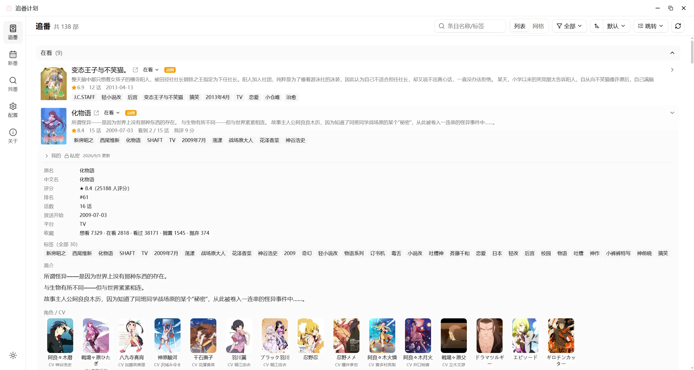
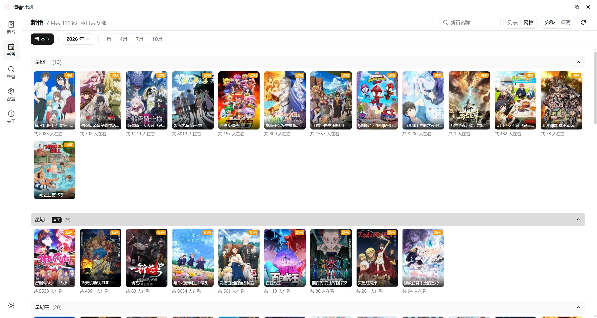
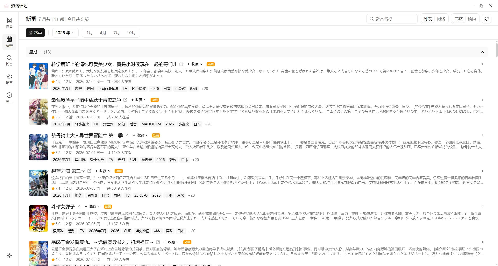
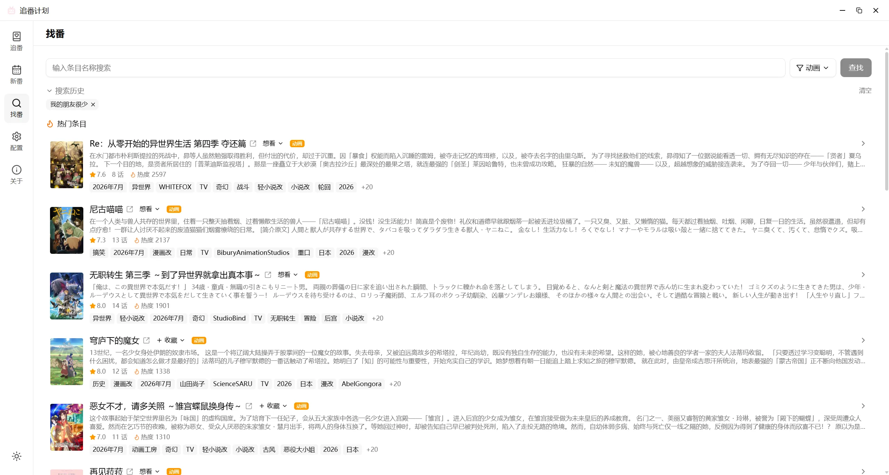
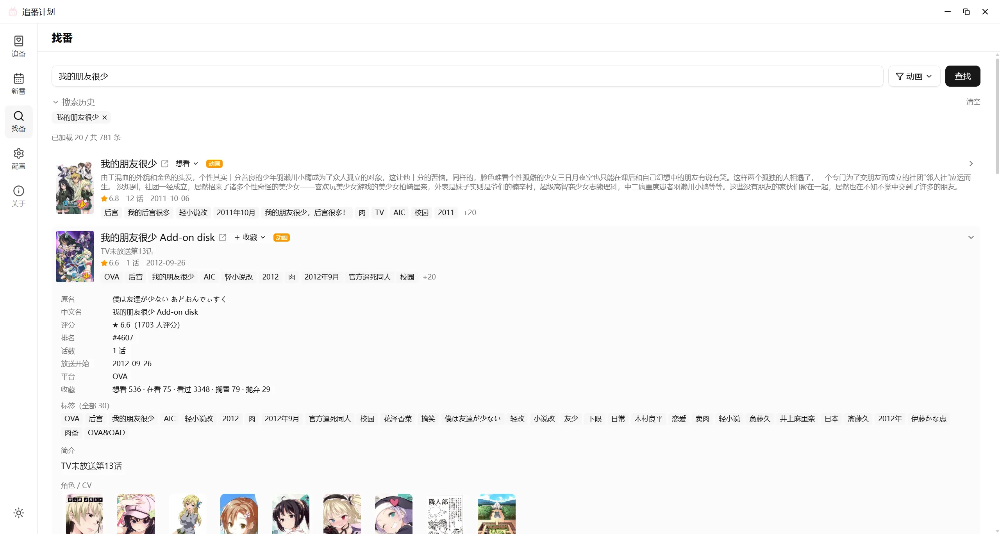
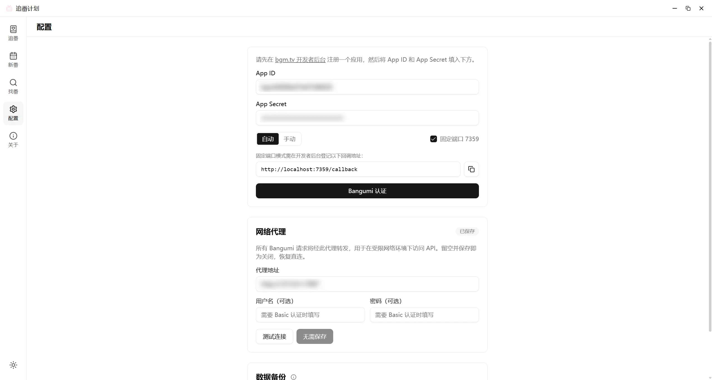
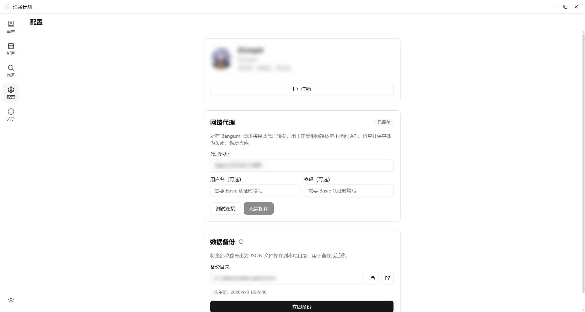

<p align="center"></p>

# 追番计划

基于 [Bangumi](https://bgm.tv) API 的 Windows 桌面端追番记录应用。数据全部存于 Bangumi 账户，本地不落库，仅保存凭据与界面偏好。

<p align="left">
  
  
  
  
  
  
</p>

## 功能

- **追番**：动画、书籍、音乐、游戏、三次元五类收藏，列表 / 网格双视图，支持搜索、类型筛选与多维排序
- **新番**：本季每日放送日历，可回看 2015 年以来的历史季度与已公布的未来季度
- **找番**：热度榜 + 关键词搜索，带搜索历史
- **条目详情**：评分、观看进度、备注，以及角色 CV、关联条目、相关推荐
- **其他**：亮 / 暗 / 跟随系统主题，HTTP 代理，收藏数据一键导出 JSON 备份

## 界面

**追番 —— 我的收藏**

|   视图   |  视图 + 详情  |
| :------: | :----------: |
|  |  |
|  |  |

**新番 —— 每日放送与季度浏览**

|  网格视图  |  列表视图  |
| :-------: | :-------: |
|  |  |

**找番 —— 热度榜与搜索**

|  热度榜  |   搜索   |
| :-----: | :------: |
|  |  |

**配置**

|   未登录   |   已登录   |
| :-------: | :-------: |
|  |  |

## 下载

到 [Releases](https://github.com/GitZhiQing/anime-watchlist/releases) 下载最新的便携版压缩包，解压即可运行，无需安装。首次使用需自建 Bangumi 应用凭据，见下节。

## 首次使用

1. 到 [Bangumi 开发者平台](https://bgm.tv/dev/app) 创建一个新应用
   - 应用名：Anime Watchlist
   - 主页地址：https://github.com/GitZhiQing/anime-watchlist
   - 类型：应用
   - 简介：一个基于 Bangumi API 的追番列表桌面应用。
   - 跨域请求：不勾选
2. 启动应用 →「配置」→ 填入平台生成的 App ID 与 App Secret
3. 点击「Bangumi 认证」，浏览器授权后回到应用即完成

## 开发

```bash
npm install
npm run tauri dev    # 开发模式
npm run tauri build  # 构建便携版 exe
npx tsc --noEmit     # 类型检查
```

## 说明

所有收藏默认**私密**，目前不支持更改。

本应用展示的全部内容（条目信息、封面、简介、评分等）均来自 Bangumi，版权归 Bangumi 及其贡献者所有。你的收藏数据存储在 Bangumi 账户中，本地仅保存 OAuth 凭据与界面偏好。

本应用为第三方开源项目，与 Bangumi 无官方隶属关系。
