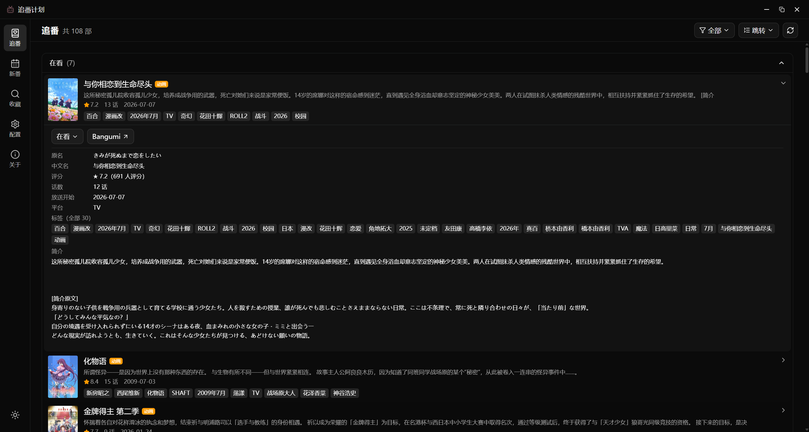
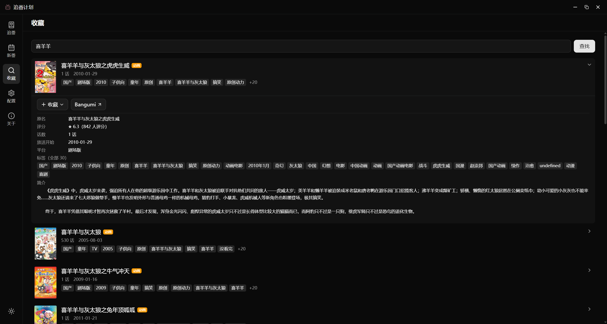
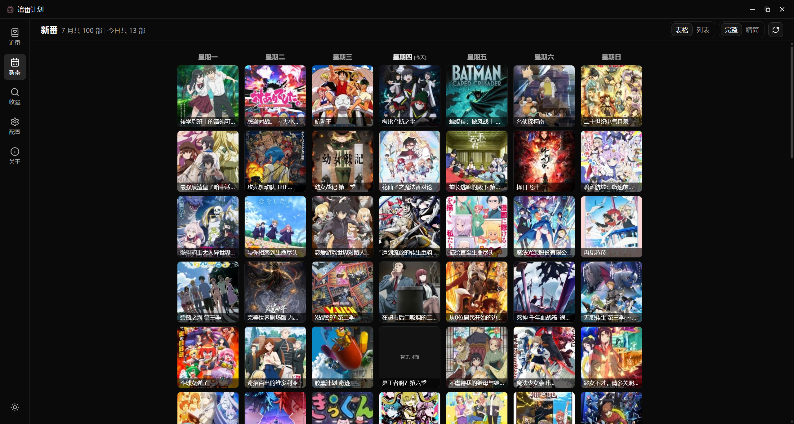
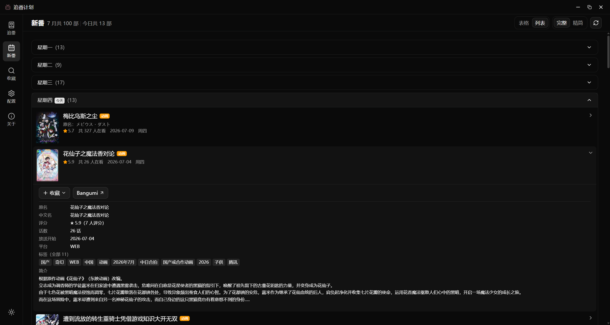

<p align="center"></p>

# 追番计划

基于 [Bangumi](https://bgm.tv) API 的 Windows 桌面端追番记录应用。

<p align="left">
  
  
  
  
  
  
</p>

<p align="center">
  <table>
    <tr>
      <td></td>
      <td></td>
    </tr>
    <tr>
      <td align="center"><sub>追番</sub></td>
      <td align="center"><sub>收藏</sub></td>
    </tr>
  </table>
</p>

<p align="center">
  <table>
    <tr>
      <td></td>
      <td></td>
    </tr>
    <tr>
      <td align="center"><sub>新番-表格</sub></td>
      <td align="center"><sub>新番-列表</sub></td>
    </tr>
  </table>
</p>

## 首次使用

1. 到 [Bangumi 开发者平台](https://bgm.tv/dev/app) 创建一个新应用
   - 应用名：Anime Watchlist
   - 主页地址：https://github.com/GitZhiQing/anime-watchlist
   - 类型：应用
   - 简介：一个基于 Bangumi API 的追番列表桌面应用。
   - 跨域请求：不勾选
2. 启动应用 →「配置」→ 填入平台生成的 App ID 与 App Secret
3. 点击「Bangumi 认证」，浏览器授权后回到应用即完成

## 开发

```bash
npm install
npm run tauri dev    # 开发模式
npm run tauri build  # 打包 Windows 安装包
```

## 说明

所有收藏默认**私密**，目前不支持更改。
应用仅存储认证令牌和应用偏好，其他 Bangumi 数据均不落库。
